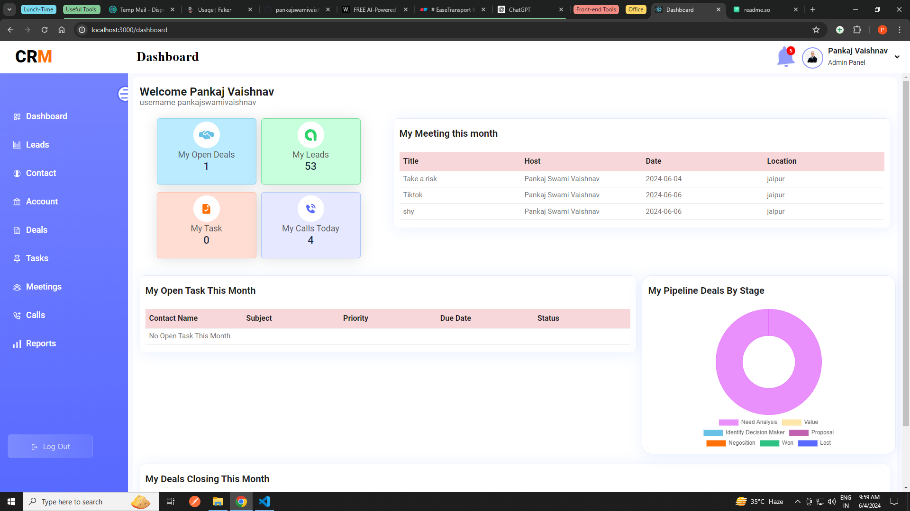
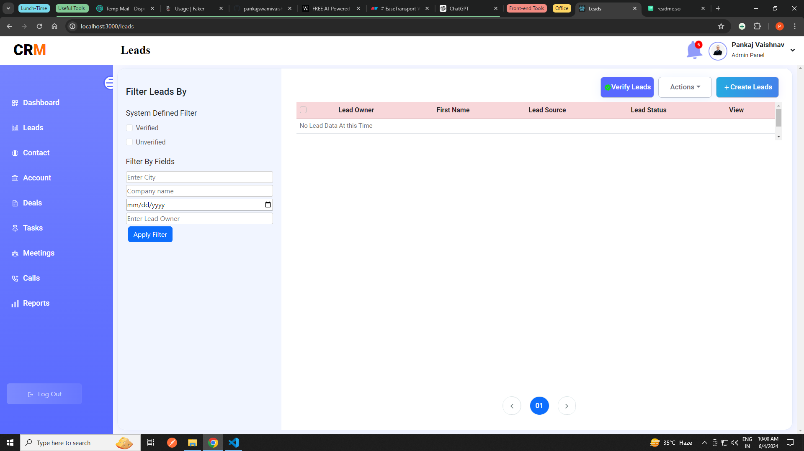
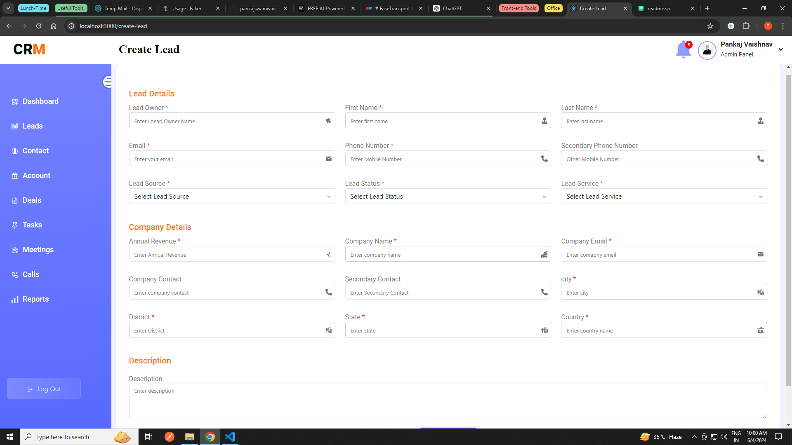
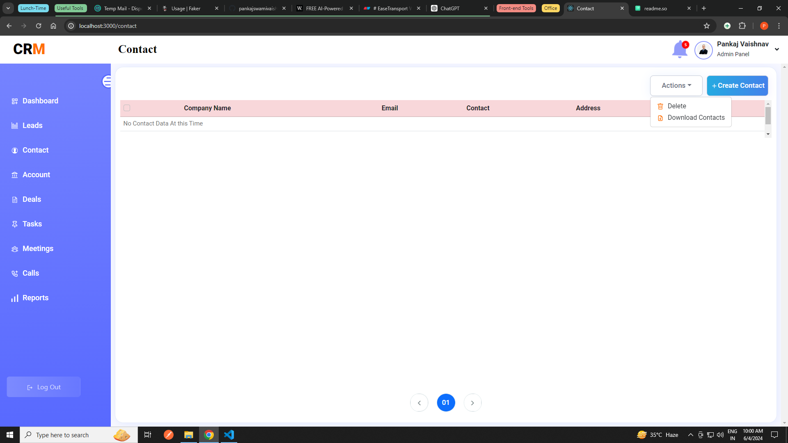
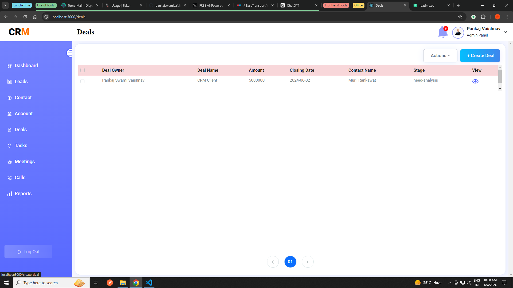
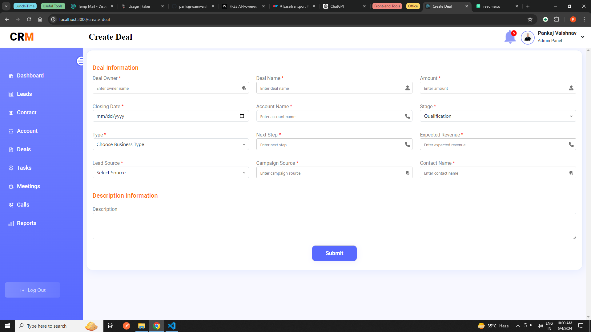
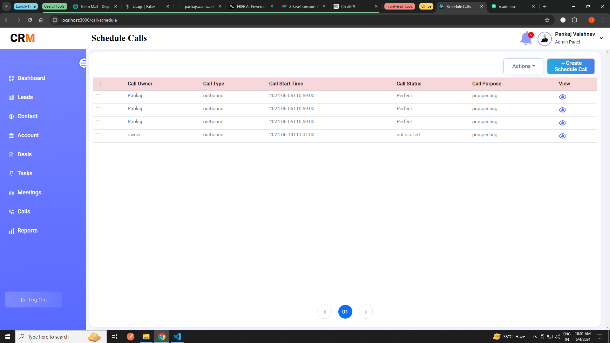
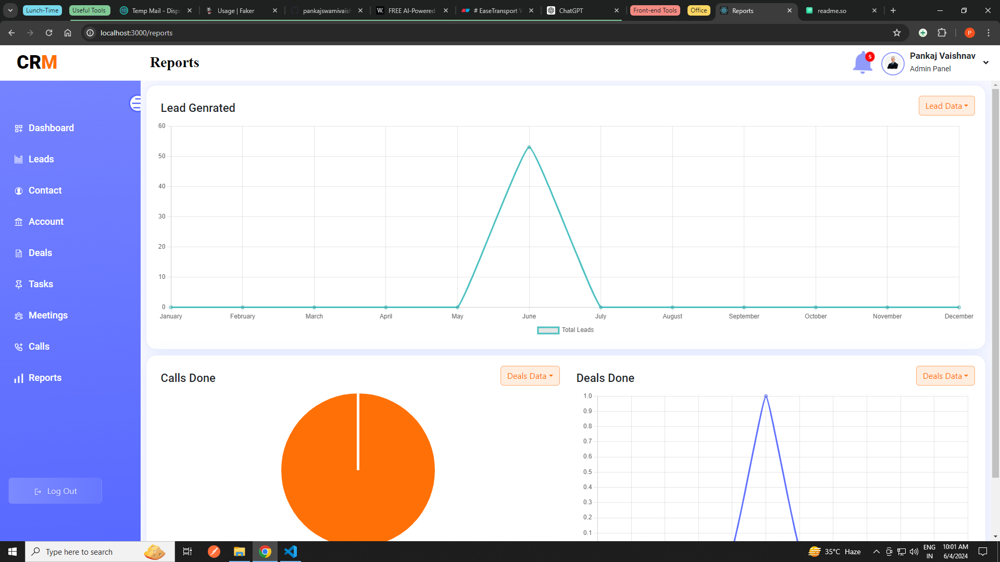

# CRM A Singhsoft Product

Welcome to the CRM (Customer Relationship Management) web application developed by Singhsoft company. A CRM web application with the frontend built in React and the backend in Java Spring Boot. This application is designed to keep track of every lead of a customer and ensure thorough work is done on it until a deal is finalized. It maintains the status of each lead and securely stores customer details. The web application includes functionalities such as creating, updating, and deleting leads, as well as options for uploading and downloading lead data.

Note: Similarly, these functionalities extend to contacts, accounts, deals, tasks, meetings, and calls.

## Getting Started

To get started with the frontend, follow these steps:

1. Open the `crm` folder in your preferred code editor (we recommend VS Code).
2. Run `npm install` in the terminal to install all the necessary node modules required for the frontend.
3. After the installation is complete, run `npm start` to start the frontend server.
4. Once the frontend server is up and running, you can access the CRM web application in your web browser.

## Available Scripts

In the project directory, you can run:

### `npm start`

Runs the app in the development mode.\
Open [http://localhost:3000](http://localhost:3000) to view it in your browser.

The page will reload when you make changes.\
You may also see any lint errors in the console.

### `npm run build`

Builds the app for production to the `build` folder.\
It correctly bundles React in production mode and optimizes the build for the best performance.

The build is minified and the filenames include the hashes.\
Your app is ready to be deployed!


## Connecting to the Backend

To connect the frontend to the backend, ensure that the Java Spring Boot backend server is running. Follow the instructions provided in the backend repository to start the server.

## Additional Notes

- Make sure you have npm installed on your system before proceeding with the frontend setup.
- Ensure that the backend server is running before accessing the functionalities of the CRM web application.

For any further assistance or inquiries, feel free to contact us - Singhsoft Company.

Happy CRM-Web!

## API Reference

- Base Url = http://192.168.1.31:8080

#### SIGN UP USER

```http
BASE_URL/user/createuser
```

| Parameter  | Type     | Description              |
| :--------- | :------- | :----------------------- |
| `userData` | `Object` | **Required**. signupUser |

Sure, I'll create a README section for each of these endpoints similar to the example you provided for the `SIGN UP USER` endpoint.

### OTP VERIFICATION

```http
POST ${BASE_URL}/user/verifyOtp
```

| Parameter | Type     | Description                |
| :-------- | :------- | :------------------------- |
| `otpData` | `Object` | **Required**. The OTP data |

### RESEND OTP

```http
GET ${BASE_URL}/user/resendOtp?email=
```

| Parameter | Type     | Description                |
| :-------- | :------- | :------------------------- |
| `email`   | `String` | **Required**. User's email |

### LOGIN USER

```http
POST ${BASE_URL}/user/signin
```

| Parameter   | Type     | Description                  |
| :---------- | :------- | :--------------------------- |
| `loginData` | `Object` | **Required**. The login data |

### LOGOUT USER

```http
POST ${BASE_URL}/user/logout
```

| Parameter | Type | Description   |
| :-------- | :--- | :------------ |
| None      |      | No parameters |

### FORGOT PASSWORD

```http
POST ${BASE_URL}/auth/forgotPassword
```

| Parameter   | Type     | Description                  |
| :---------- | :------- | :--------------------------- |
| `emailData` | `Object` | **Required**. The email data |

### RESET PASSWORD VALIDATE

```http
GET ${BASE_URL}/auth/validate-reset-link?uid=
```

| Parameter | Type     | Description                       |
| :-------- | :------- | :-------------------------------- |
| `uid`     | `String` | **Required**. User ID to validate |

### RESET PASSWORD

```http
POST ${BASE_URL}/auth/resetPassword?uid=
```

| Parameter      | Type     | Description                         |
| :------------- | :------- | :---------------------------------- |
| `uid`          | `String` | **Required**. User ID to reset      |
| `passwordData` | `Object` | **Required**. The new password data |

### UPDATE PROFILE

```http
POST ${BASE_URL}/user/updateProfile
```

| Parameter     | Type     | Description                              |
| :------------ | :------- | :--------------------------------------- |
| `profileData` | `Object` | **Required**. The profile data to update |

### UPLOAD USER IMAGE

```http
POST ${BASE_URL}/user/uploadUserImage
```

| Parameter   | Type     | Description                            |
| :---------- | :------- | :------------------------------------- |
| `imageData` | `Object` | **Required**. The image data to upload |

### GET USER IMAGE

```http
GET ${BASE_URL}/profile/getUserImage
```

| Parameter | Type | Description   |
| :-------- | :--- | :------------ |
| None      |      | No parameters |

Here are the README sections for the dashboard configuration APIs, including a comment indicating that these are dashboard configuration APIs.

```
// Dashboard configuration Api
```

### MONHTLY MEETINGS

```http
GET ${BASE_URL}/meet/byMonth?userId=
```

| Parameter | Type     | Description               |
| :-------- | :------- | :------------------------ |
| `userId`  | `String` | **Required**. The user ID |

### MONTHLY TASK

```http
GET ${BASE_URL}/tasks/byMonth?userId=
```

| Parameter | Type     | Description               |
| :-------- | :------- | :------------------------ |
| `userId`  | `String` | **Required**. The user ID |

### MONTHLY CLOSING DEALS

```http
GET ${BASE_URL}/deals/dealClosingThisMonth?userId=
```

| Parameter | Type     | Description               |
| :-------- | :------- | :------------------------ |
| `userId`  | `String` | **Required**. The user ID |

### PIPELINE DEALS

```http
GET ${BASE_URL}/deals/countOfDealByStage?userId=
```

| Parameter | Type     | Description               |
| :-------- | :------- | :------------------------ |
| `userId`  | `String` | **Required**. The user ID |

### GET CURRENT USER

```http
GET ${BASE_URL}/dashboard/getCurrentUser
```

| Parameter | Type | Description   |
| :-------- | :--- | :------------ |
| None      |      | No parameters |

Sure, here are the README sections for the leads configuration APIs:

```
// Leads Configuration Url
```

### CREATE LEAD

```http
POST ${BASE_URL}/leadInfo/saveLeadInfo
```

| Parameter  | Type     | Description                 |
| :--------- | :------- | :-------------------------- |
| `leadData` | `Object` | **Required**. The lead data |

### GET ALL LEADS

```http
GET ${BASE_URL}/leadInfo/getAllLeads?userId=
```

| Parameter | Type     | Description               |
| :-------- | :------- | :------------------------ |
| `userId`  | `String` | **Required**. The user ID |

### GET SINGLE LEAD

```http
GET ${BASE_URL}/leadInfo/getLeadById?leadId=
```

| Parameter | Type     | Description               |
| :-------- | :------- | :------------------------ |
| `leadId`  | `String` | **Required**. The lead ID |

### DELETE LEADS

```http
DELETE ${BASE_URL}/leadInfo/deleteMultipleByLeadId?leadId=
```

| Parameter | Type     | Description               |
| :-------- | :------- | :------------------------ |
| `leadId`  | `String` | **Required**. The lead ID |

### SINGLE LEAD UPDATE

```http
PUT ${BASE_URL}/leadInfo/updateLeadById?leadId=
```

| Parameter  | Type     | Description                         |
| :--------- | :------- | :---------------------------------- |
| `leadId`   | `String` | **Required**. The lead ID           |
| `leadData` | `Object` | **Required**. The updated lead data |

### GET ALL LEADS BY FILTER

```http
GET ${BASE_URL}/leadInfo/leads/filter?
```

| Parameter | Type     | Description                     |
| :-------- | :------- | :------------------------------ |
| Various   | `String` | **Optional**. Filter parameters |

### VERIFY LEADS

```http
POST ${BASE_URL}/leadInfo/verifyLead?leads=
```

| Parameter | Type     | Description                       |
| :-------- | :------- | :-------------------------------- |
| `leads`   | `String` | **Required**. The leads to verify |

### DOWNLOAD LEADS

```http
GET ${BASE_URL}/leadInfo/downloadLeads
```

| Parameter | Type | Description   |
| :-------- | :--- | :------------ |
| None      |      | No parameters |

### UPLOAD LEADS

```http
POST ${BASE_URL}/leadInfo/uploadLead
```

| Parameter  | Type     | Description                           |
| :--------- | :------- | :------------------------------------ |
| `leadData` | `Object` | **Required**. The lead data to upload |

Sure, here are the README sections for the Contact, Account, Deal, Task, and Meeting configuration URLs:

```
// Contact Configuration Url
```

### CREATE CONTACT

```http
POST ${BASE_URL}/contact/saveContact
```

| Parameter     | Type     | Description                    |
| :------------ | :------- | :----------------------------- |
| `contactData` | `Object` | **Required**. The contact data |

### GET ALL CONTACTS

```http
GET ${BASE_URL}/contact/getAllContact?page=
```

| Parameter | Type      | Description               |
| :-------- | :-------- | :------------------------ |
| `page`    | `Integer` | **Required**. Page number |

### DELETE CONTACT

```http
DELETE ${BASE_URL}/contact/deleteMultipleByContactId?contactId=
```

| Parameter   | Type     | Description                  |
| :---------- | :------- | :--------------------------- |
| `contactId` | `String` | **Required**. The contact ID |

### GET CONTACTS

```http
GET ${BASE_URL}/contact/getContacts
```

| Parameter | Type | Description   |
| :-------- | :--- | :------------ |
| None      |      | No parameters |

### GET SINGLE CONTACT

```http
GET ${BASE_URL}/contact/getContactByContactId?contactId=
```

| Parameter   | Type     | Description                  |
| :---------- | :------- | :--------------------------- |
| `contactId` | `String` | **Required**. The contact ID |

### DOWNLOAD CONTACTS

```http
GET ${BASE_URL}/contact/downloadContacts?userId=
```

| Parameter | Type     | Description               |
| :-------- | :------- | :------------------------ |
| `userId`  | `String` | **Required**. The user ID |

```
// Account Configuration Url
```

### CREATE ACCOUNT

```http
POST ${BASE_URL}/account/createAccount
```

| Parameter     | Type     | Description                    |
| :------------ | :------- | :----------------------------- |
| `accountData` | `Object` | **Required**. The account data |

### GET ALL ACCOUNTS

```http
GET ${BASE_URL}/account/getAllAccounts?page=
```

| Parameter | Type      | Description               |
| :-------- | :-------- | :------------------------ |
| `page`    | `Integer` | **Required**. Page number |

### DOWNLOAD ACCOUNT

```http
GET ${BASE_URL}/account/downloadAccount?userId=
```

| Parameter | Type     | Description               |
| :-------- | :------- | :------------------------ |
| `userId`  | `String` | **Required**. The user ID |

### GET SINGLE ACCOUNT

```http
GET ${BASE_URL}/account/getAccountById?accountId=
```

| Parameter   | Type     | Description                  |
| :---------- | :------- | :--------------------------- |
| `accountId` | `String` | **Required**. The account ID |

### DELETE ACCOUNT

```http
DELETE ${BASE_URL}/account/deleteMultipleByAccountId?accountId=
```

| Parameter   | Type     | Description                  |
| :---------- | :------- | :--------------------------- |
| `accountId` | `String` | **Required**. The account ID |

### UPDATE SINGLE ACCOUNT

```http
PUT ${BASE_URL}/account/updateAccountByAccountId?accountId=
```

| Parameter     | Type     | Description                            |
| :------------ | :------- | :------------------------------------- |
| `accountId`   | `String` | **Required**. The account ID           |
| `accountData` | `Object` | **Required**. The updated account data |

```
// Deal Configuration Url
```

### CREATE DEAL

```http
POST ${BASE_URL}/deals/addDeal
```

| Parameter  | Type     | Description                 |
| :--------- | :------- | :-------------------------- |
| `dealData` | `Object` | **Required**. The deal data |

### GET ALL DEALS

```http
GET ${BASE_URL}/deals/getAllDeal?
```

| Parameter | Type | Description   |
| :-------- | :--- | :------------ |
| None      |      | No parameters |

### GET SINGLE DEAL

```http
GET ${BASE_URL}/deals/getDealById?dealId=
```

| Parameter | Type     | Description               |
| :-------- | :------- | :------------------------ |
| `dealId`  | `String` | **Required**. The deal ID |

### DELETE DEALS

```http
DELETE ${BASE_URL}/deals/deleteMultipleByDealId?dealsId=
```

| Parameter | Type     | Description                |
| :-------- | :------- | :------------------------- |
| `dealsId` | `String` | **Required**. The deals ID |

### UPDATE SINGLE DEAL

```http
PUT ${BASE_URL}/deals/updateDealById?dealId=
```

| Parameter  | Type     | Description                         |
| :--------- | :------- | :---------------------------------- |
| `dealId`   | `String` | **Required**. The deal ID           |
| `dealData` | `Object` | **Required**. The updated deal data |

### DOWNLOAD DEALS

```http
GET ${BASE_URL}/deals/downloadDeals
```

| Parameter | Type | Description   |
| :-------- | :--- | :------------ |
| None      |      | No parameters |

### UPLOAD DEAL

```http
POST ${BASE_URL}/deals/uploadDeal
```

| Parameter  | Type     | Description                           |
| :--------- | :------- | :------------------------------------ |
| `dealData` | `Object` | **Required**. The deal data to upload |

```
// Task Configuration Url
```

### CREATE TASK

```http
POST ${BASE_URL}/tasks/addTask
```

| Parameter  | Type     | Description                 |
| :--------- | :------- | :-------------------------- |
| `taskData` | `Object` | **Required**. The task data |

### GET ALL TASKS

```http
GET ${BASE_URL}/tasks/getAllTasks?
```

| Parameter | Type | Description   |
| :-------- | :--- | :------------ |
| None      |      | No parameters |

### DELETE TASK

```http
DELETE ${BASE_URL}/tasks/deleteMultipleByTaskId?taskId=
```

| Parameter | Type     | Description               |
| :-------- | :------- | :------------------------ |
| `taskId`  | `String` | **Required**. The task ID |

### GET SINGLE TASK

```http
GET ${BASE_URL}/tasks/getTasksById?taskId=
```

| Parameter | Type     | Description               |
| :-------- | :------- | :------------------------ |
| `taskId`  | `String` | **Required**. The task ID |

### DOWNLOAD TASKS

```http
GET ${BASE_URL}/tasks/downloadTasks
```

| Parameter | Type | Description   |
| :-------- | :--- | :------------ |
| None      |      | No parameters |

### UPDATE TASK

```http
PUT ${BASE_URL}/tasks/updateTaskById?taskId=
```

| Parameter  | Type     | Description                         |
| :--------- | :------- | :---------------------------------- |
| `taskId`   | `String` | **Required**. The task ID           |
| `taskData` | `Object` | **Required**. The updated task data |

### UPLOAD TASKS

```http
POST ${BASE_URL}/tasks/uploadTasks
```

| Parameter  | Type     | Description                           |
| :--------- | :------- | :------------------------------------ |
| `taskData` | `Object` | **Required**. The task data to upload |

```
// Meeting Configuration Url
```

### CREATE MEETING

```http
POST ${BASE_URL}/meet/scheduleMeet
```

| Parameter  | Type     | Description                    |
| :--------- | :------- | :----------------------------- |
| `meetData` | `Object` | **Required**. The meeting data |

### GET ALL MEETINGS

```http
GET ${BASE_URL}/meet/getAllMeetings?
```

| Parameter | Type | Description   |
| :-------- | :--- | :------------ |
| None      |      | No parameters |

### DELETE MEETINGS

```http
DELETE ${BASE_URL}/meet/deleteMultipleMeetings?meetingsId=
```

| Parameter    | Type     | Description                   |
| :----------- | :------- | :---------------------------- |
| `meetingsId` | `String` | **Required**. The meetings ID |

### UPDATE MEETING

```http
PUT ${BASE_URL}/meet/updateMeeting?meetingId=
```

| Parameter   | Type     | Description                            |
| :---------- | :------- | :------------------------------------- |
| `meetingId` | `String` | **Required**. The meeting ID           |
| `meetData`  | `Object` | **Required**. The updated meeting data |

### GET SINGLE MEETING

```http
GET ${BASE_URL}/meet/getMeetingById?meetingId=
```

| Parameter   | Type     | Description                  |
| :---------- | :------- | :--------------------------- |
| `meetingId` | `String` | **Required**. The meeting ID |

### DOWNLOAD MEETINGS

```http
GET ${BASE_URL}/meet/downloadMeetings
```

| Parameter | Type | Description   |
| :-------- | :--- | :------------ |
| None      |      | No parameters |

### UPLOAD MEETING

```http
POST ${BASE_URL}/meet/uploadMeeting

Sure, here are the README sections for the Call and Report configuration URLs:

```

// Call Configuration Url

````

### CREATE SCHEDULE CALL

```http
POST ${BASE_URL}/call/addCall
````

| Parameter  | Type     | Description                           |
| :--------- | :------- | :------------------------------------ |
| `callData` | `Object` | **Required**. The scheduled call data |

### CREATE LOG CALL

```http
POST ${BASE_URL}/callLog/createCallLog
```

| Parameter     | Type     | Description                     |
| :------------ | :------- | :------------------------------ |
| `callLogData` | `Object` | **Required**. The call log data |

### GET ALL SCHEDULE CALLS

```http
GET ${BASE_URL}/call/getAllScheduleCall?
```

| Parameter | Type | Description   |
| :-------- | :--- | :------------ |
| None      |      | No parameters |

### GET ALL LOG CALLS

```http
GET ${BASE_URL}/callLog/getAllCallLog?
```

| Parameter | Type | Description   |
| :-------- | :--- | :------------ |
| None      |      | No parameters |

### GET SINGLE SCHEDULE CALL

```http
GET ${BASE_URL}/call/getCallById?callId=
```

| Parameter | Type     | Description                         |
| :-------- | :------- | :---------------------------------- |
| `callId`  | `String` | **Required**. The scheduled call ID |

### GET SINGLE LOG CALL

```http
GET ${BASE_URL}/callLog/getCallLogById?callLogId=
```

| Parameter   | Type     | Description                   |
| :---------- | :------- | :---------------------------- |
| `callLogId` | `String` | **Required**. The call log ID |

### DELETE SCHEDULE CALL

```http
DELETE ${BASE_URL}/call/deleteMultipleCall?callsId=
```

| Parameter | Type     | Description                          |
| :-------- | :------- | :----------------------------------- |
| `callsId` | `String` | **Required**. The scheduled call IDs |

### DELETE LOG CALL

```http
DELETE ${BASE_URL}/callLog/deleteMultipleCallLog?callLogsId=
```

| Parameter    | Type     | Description                    |
| :----------- | :------- | :----------------------------- |
| `callLogsId` | `String` | **Required**. The call log IDs |

### UPLOAD SCHEDULE CALLS

```http
POST ${BASE_URL}/call/uploadCalls
```

| Parameter  | Type     | Description                                     |
| :--------- | :------- | :---------------------------------------------- |
| `callData` | `Object` | **Required**. The scheduled call data to upload |

### UPLOAD LOG CALLS

```http
POST ${BASE_URL}/callLog/uploadCallLogs
```

| Parameter     | Type     | Description                               |
| :------------ | :------- | :---------------------------------------- |
| `callLogData` | `Object` | **Required**. The call log data to upload |

### DOWNLOAD SCHEDULE CALLS

```http
GET ${BASE_URL}/call/downloadCallsInfo
```

| Parameter | Type | Description   |
| :-------- | :--- | :------------ |
| None      |      | No parameters |

### DOWNLOAD LOG CALLS

```http
GET ${BASE_URL}/callLog/downloadCallLog
```

| Parameter | Type | Description   |
| :-------- | :--- | :------------ |
| None      |      | No parameters |

### UPDATE SCHEDULE CALL

```http
PUT ${BASE_URL}/call/updateCall?callId=
```

| Parameter  | Type     | Description                                   |
| :--------- | :------- | :-------------------------------------------- |
| `callId`   | `String` | **Required**. The scheduled call ID           |
| `callData` | `Object` | **Required**. The updated scheduled call data |

### UPDATE LOG CALL

```http
PUT ${BASE_URL}/callLog/updateCallLog?callLogId=
```

| Parameter     | Type     | Description                             |
| :------------ | :------- | :-------------------------------------- |
| `callLogId`   | `String` | **Required**. The call log ID           |
| `callLogData` | `Object` | **Required**. The updated call log data |

```
// Report Configuration Url
```

### GET GENERATED LEADS REPORT

```http
GET ${BASE_URL}/report/getLeadReport?leadBy=
```

| Parameter | Type     | Description               |
| :-------- | :------- | :------------------------ |
| `leadBy`  | `String` | **Required**. Lead filter |

### GET DEALS DONE REPORT

```http
GET ${BASE_URL}/report/getDealsReport?dealsBy=
```

| Parameter | Type     | Description                |
| :-------- | :------- | :------------------------- |
| `dealsBy` | `String` | **Required**. Deals filter |

### GET DONE CALLS REPORT

```http
GET ${BASE_URL}/report/getCallReport?callsBy=
```

| Parameter | Type     | Description                |
| :-------- | :------- | :------------------------- |
| `callsBy` | `String` | **Required**. Calls filter |

## Screenshots












## Authors

- [@pankajswamivaishnav](https://www.github.com/pankajswamivaishnav-singhsoft)
## 🚀 About Me
Pankaj Swami Vaishnav
I'm a full stack developer in singhsoft pvt ltd company. Aprat From this i have deep knowledge and skill in proramming and netorking. I have gained multiple certificate who showcase my knowledge & skill, I won a hackathon IIM2.0.

